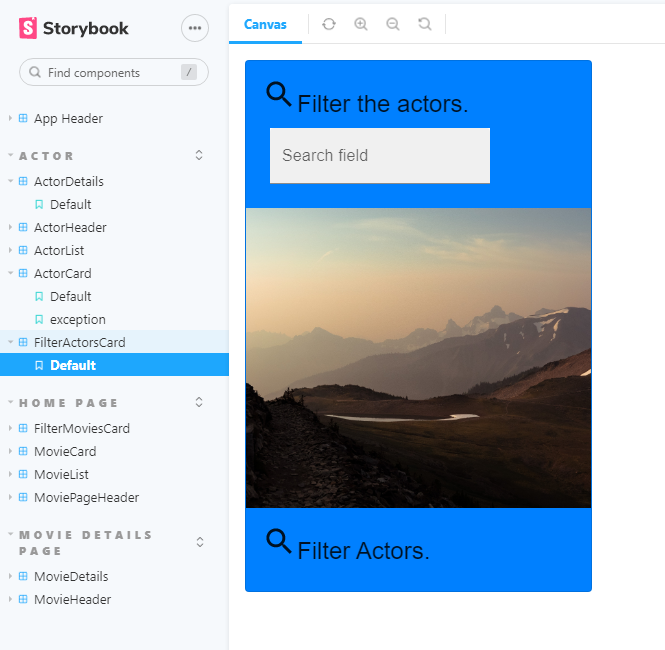
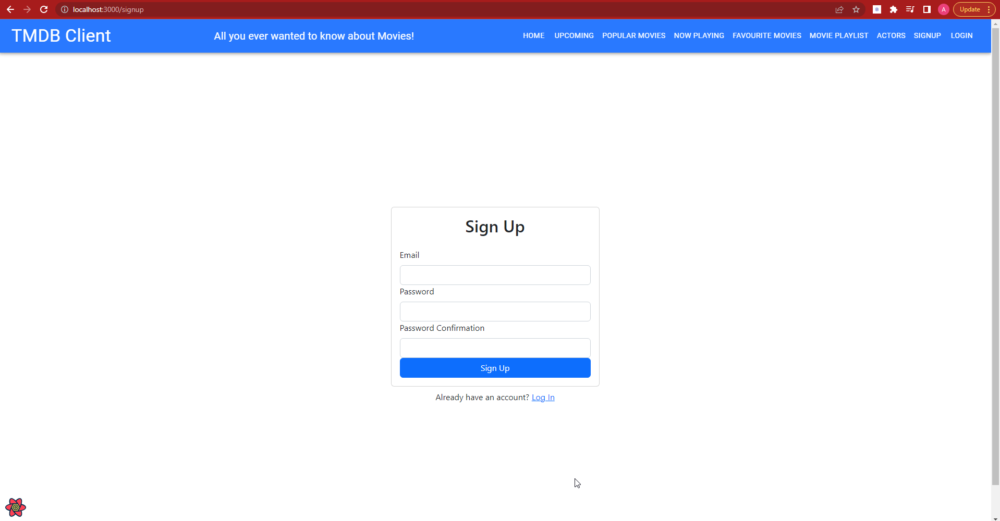
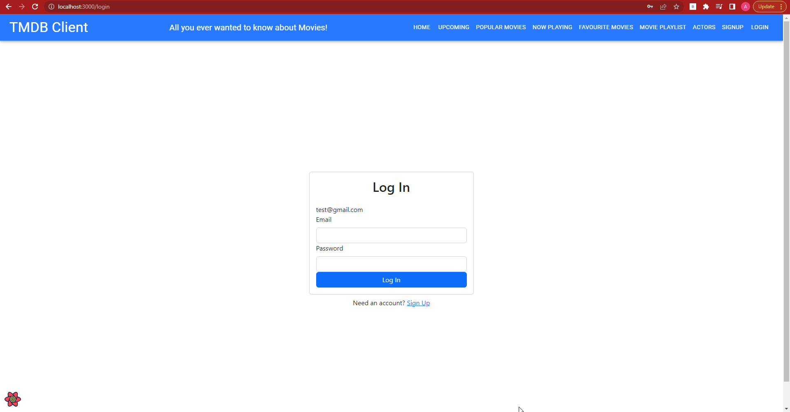
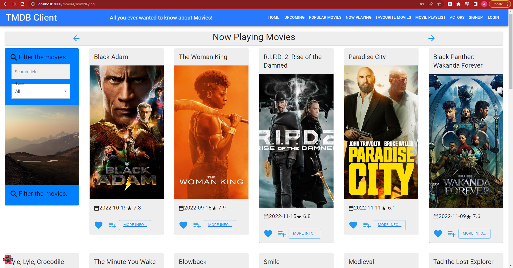
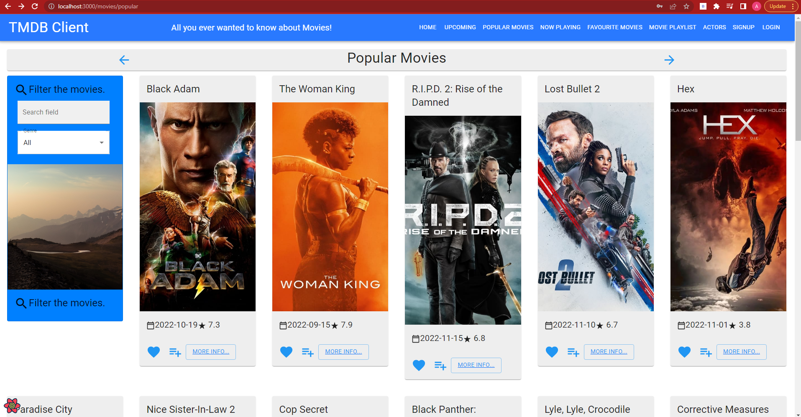
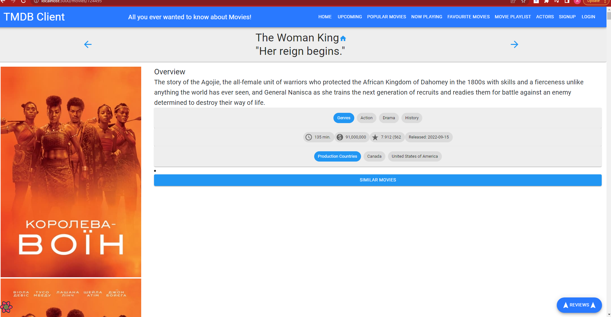
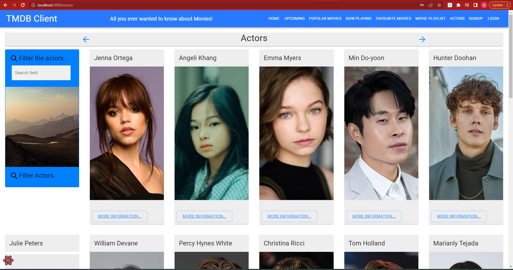
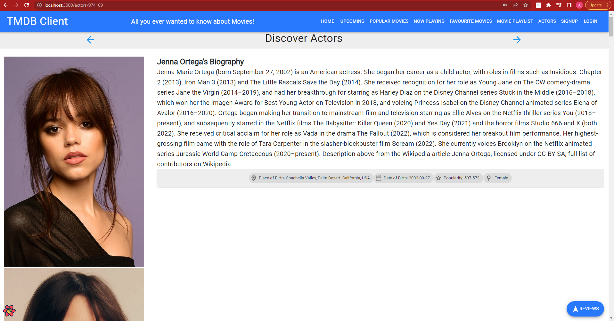
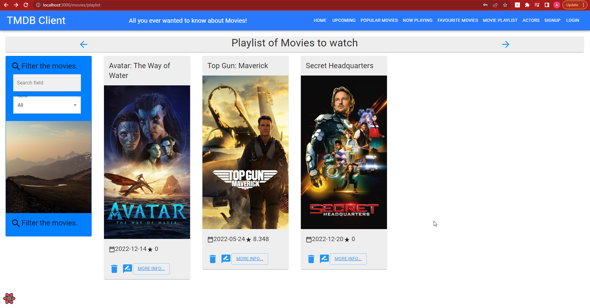

# Web App Dev 2 - Assignment 1 - ReactJS app.

Name: [your name]

## Overview.

### New Pages.

[ Provide a bullet-point list of the new pages you added to the Movies Fan add (include modifications to existing pages).]

e.g.

+ Sign up and Login Page
+ Now Playing Movies Page
+ Popular Movies Page
+ List of Actors Page
+ Actor Details Page
+ Playlist Page
+ Similar Movies Page - button on Movie details page

### New Features.

[ Provide a bullet-point list of the __new features__ you added to the Movies Fan app.] 
 
 e.g.

+ Authentication (using Firebase) but Private Routes not working! Sign up and Log in do work, but can't do anything with them.
+ Movie Details page has a button that takes you to a new page that shows similar movies to the movie you are viewing
+ new Data Model - Actors
+ Filtering for Actors by name
+ Storybook support for Actor components
+ homepage movie list sorted by revenue to differentiate from another page

## Setup requirements.

[ Outline any non-standard setup steps necessary to run your app locally after cloning the repo.]
npm install
npm install firebase
npm install --save  bootstrap@4.4.1
npm i bootstrap react-bootstrap

a .env file needs to created and your own keys/values added
REACT_APP_TMDB_KEY=
FAST_REFRESH=false
REACT_APP_FIREBASE_API_KEY=
REACT_APP_FIREBASE_AUTH_DOMAIN=
REACT_APP_FIREBASE_PROJECT_ID=
REACT_APP_FIREBASE_STORAGE_BUCKET=
REACT_APP_FIREBASE_MESSAGING_SENDER_ID=
REACT_APP_FIREBASE_APP_ID=
REACT_APP_FIREBASE_MEASUREMENT_ID=

## TMDB endpoints.

[ List the __additional__ TMDB endpoints used, giving the description and pathname for each one.] 

e.g.

+ /movie/popular - Popular Movies.
+ /movie/${id}/similar - A list of similar movies. 
+ /movie/now_playing - Now Playing Movies.
+ person/${id}/images - Actor Images.
+ person/popular -  get Popular Actors.
+ person/${id} - getting an individual Actor.

## App Design.

### Component catalogue.

[ Below is my storybook page, I have added actor storie
+ actorDetails
+ actorHeader
+ actorList
+ actorsCard
+ filterActorsCard
] .......

e.g.

### UI Design.

[ Insert screenshots of the __new app pages__ you developed (including modified existing pages), Have an appropriate caption for each one (see example below).

>sign up page for users to sign up. using Firebase Auth.

>log in page for users after sign up. using Firebase Auth.

>list of movies that are recently released and now playing, all movies able to be faved or added to a playlist, on this page as well as all other movie pages.

>a collection of movies that are considered popular right now.

>after clicking more info on a movie, the similar movies button will take you to a new page that displays similar movies to the current movie you are viewing

>list of popular actors right now, more info will take you into actor details

>actor details page, you get here by clicking more info on the actors list page

>the result of adding movies to your playlist

### Routing.

[ List the __new routes__ supported by your app and state the associated page.]

e.g. 

+ "movies/popular" - gets the popular movies
+ "movies/nowPlaying" - movies that are currently playing
+ "movies/playlist" - playlist of movies that you want to watch
+ "movies/id/similar" - movies similar to a certain selected movie
+ "movies/favourites" - list of favourite movies
+ "movies/id" - details about a movie
+ "/actors" - actors list
+ "/actors/id" - details about an actor
+ "signup" - signup page
+ "login" - login page
+ "movies/id"

[Tried to make Favourites a private route to no success]

## Independent learning (If relevant).

[ https://www.youtube.com/watch?v=PKwu15ldZ7k - Firebase tutorial used for log in and sign up 

https://developers.themoviedb.org/3/getting-started/introduction - TMDB
]
